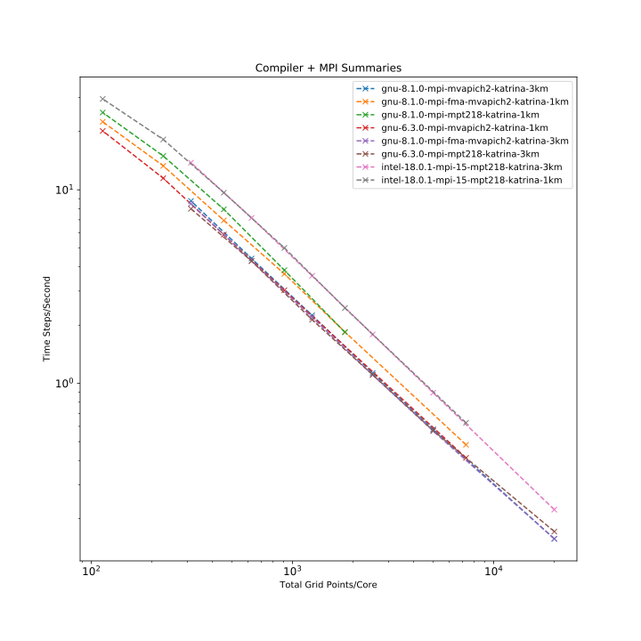

.. WRF Benchmarks documentation master file, created by
   sphinx-quickstart on Wed Jul 11 17:06:40 2018.
   You can adapt this file completely to your liking, but it should at least
   contain the root `toctree` directive.

WRF Benchmarks 
==========================================
.. contents:: Table of Contents

Scaling Results
-------------------

Below graph shows the summary of all simulations of WRF (v3.9 and v4.0) with various compilers and libraries. 
The aim for these performance benchmarks can be summarized as :
 - "Is it possible to solve a problem with such-and-such resolution in a timely manner?"
 - "If I use more cores I will have the results more quickly, but with this resolution will my run be in the efficient strong-scaling regime, an intermediate one, or in the very inefficient one dominated by I/O and initialization instead of computing?"

Configurations::
	- Compilers : Intel, GNU
	- MPI  : mpt,mvapich
	- Cases : Katrina 1km, Katrina 3km

Conclusion 
-------------------
 - Intel + MPT gives best performance. 
 - As you can see, there are three regimes:

     - large number of grid points per core - Total grid points / core > 10^5 (small core count)
     - intermediate number of grid points per core - 104 < Total grid points / core < 10^5 (intermediate core count)
     - small number of grid points per core - Total grid points / core < 10^4 (large core count)

 For a small number of cores, the WRF computation kernel is in a strong scaling regime. Increasing the core count will make the simulation go faster while it consumes approximately the same amount of core-hours (ignoring time spent in initialization and I/O). Time-to-solution will also depend on the wait in queue, which may be larger for larger jobs.
 
 For an intermediate number of cores, WRF scaling increasingly departs from linear strong scaling. Running the same simulation on larger core counts will require more core-hours even though it will still run faster (again, ignoring time spent in initialization, I/O, and wait in queue).
 
 We do not recommend running WRF on extremely large core counts, because in this regime the speed benefits diminish, the time will be dominated by initialization and I/O (as well as wait in queue), and there will be larger core-hours charges for solving the same problem.

Hybrid Runs
-------------------
- In hybrid runs, we use both Shared memory and Distributed Memory for our simulations. Hybrid runs perform better than pure MPI runs if there is good load balancing across cores. 
- The below run shows 4 or 6 MPI tasks works best for 72 CPU's. 
- WRF configuration has two options to compile against intel : option 16 and option 67. From the second graph below, we find that option 67 gives better simulation speed. 
- A summary of optimization flags used is also listed below.

Summary : WRF V.4
-------------------

.. image:: https://raw.githubusercontent.com/DixitPatel/WRF_Simulation/master/results/intel18_openmp_67_speed.png
    :width: 400px
	
- Option 67 gives slightly better simulation speed.

.. image:: https://raw.githubusercontent.com/DixitPatel/WRF_Simulation/master/results/Intel17_16vs67.png
    :width: 400px

Compiler Option 67 flags
------------------------
**Flags** : -xHost -fp-model fast=2 -no-heap-arrays -no-prec-div -no-prec-sqrt -fno-common -xCORE-AVX2

**xHost** : Tells the compiler to generate instructions for the highest instruction set available on the compilation host processor.

**fp-model fast = 2** : Controls the semantics of floating-point calculations. Enables more aggressive optimizations on floating-point data.

**-no-heap-arrays**  :  The compiler puts automatic arrays and temporary arrays in the stack storage area.

**no-prec-div** :  Improves precision of floating-point divides.  (No) : it enables optimizations that give slightly less precise results than full IEEE division.

**no-prec-sqrt** :  The compiler uses a faster but less precise implementation of square root.

**no-common** : Option -fno-common tells the compiler to treat common symbols as global definitions. When using this option, you can only have a common variable declared in one module; otherwise, a link time error will occur for multiple defined symbols.

**CORE-AVX2** :  expansion of most vector integer SSE and AVX instructions to 256 bits. NASA : https://www.nas.nasa.gov/hecc/support/kb/haswell-processors_492.html  

Misc Hybrid Runs
-------------------
Below are some other hybrid run graphs with computation times, different thread binding strategies, etc. Using omplace gives the best performance. Use dplace if you want to manually specify cpu sets.

- Intel 18.0.1 Total Computation Time

.. image:: https://raw.githubusercontent.com/DixitPatel/WRF_Simulation/master/results/intel18_openmp_67_comp.png
    :width: 400px
	
.. image:: https://raw.githubusercontent.com/DixitPatel/WRF_Simulation/master/results/intel17_openmp_16_comp.png
    :width: 400px

- Intel 17.0.1 Option 16 Simulation Time

.. image:: https://raw.githubusercontent.com/DixitPatel/WRF_Simulation/master/results/intel17_openmp_16_speed.png
    :width: 400px
	
- Intel 17.0.1 Option 67 Total Computation time and Simulation Time.

.. image:: https://raw.githubusercontent.com/DixitPatel/WRF_Simulation/master/results/intel17_openmp_67_comp.png
    :width: 300px

.. image:: https://raw.githubusercontent.com/DixitPatel/WRF_Simulation/master/results/intel17_openmp_67_speed.png
    :width: 300px

